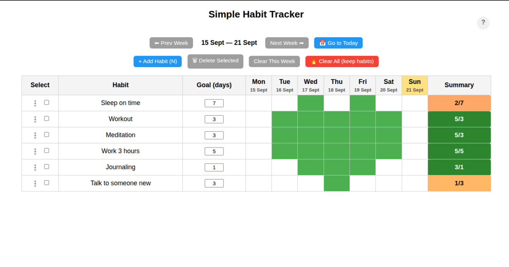

# HabitForge

A simple, intuitive habit tracking web application that helps you build and maintain good habits. Track your daily and weekly goals with a clean, visual interface with no logins locally.

## Features

- 📅 **Weekly Tracking**: View and track your habits week by week
- 🎯 **Custom Goals**: Set custom goals for each habit (e.g., 3 times per week)
- ✅ **Visual Feedback**: Color-coded cells show your progress at a glance
- 📱 **Responsive Design**: Works on both desktop and mobile devices
- 💾 **Local Storage**: Your data is saved in your browser
- 🎨 **Clean Interface**: Simple and distraction-free UI

## How to Use

1. **Add a New Habit**:
   - Click the "Add Habit" button
   - Enter a name for your habit (e.g., "Exercise", "Read", "Meditate")
   - Set your weekly goal (number of times per week)

2. **Track Your Progress**:
   - Click on a day to mark a habit as completed
   - The cell will turn green when checked
   - Your weekly progress is shown in the summary column

3. **Navigate Between Weeks**:
   - Use the "<" and ">" buttons to move between weeks
   - Click "Today" to return to the current week

## Keyboard Shortcuts

- `N`: Add a new habit

## Data Management

- Your habits and progress are automatically saved in your browser's local storage
- Use the "Clear Week" button to reset the current week's progress
- Use "Clear All" to remove all habits and start fresh

## Technical Details

- Built with vanilla JavaScript, HTML, and CSS
- No external dependencies
- Uses browser's local storage for data persistence

## Getting Started

Simply open `index.html` in your web browser to start using HabitForge. No installation, login or setup required!

## License

This project is open source and available under the [MIT License](LICENSE).

## Contributing

Contributions are welcome! Please feel free to submit a Pull Request.
